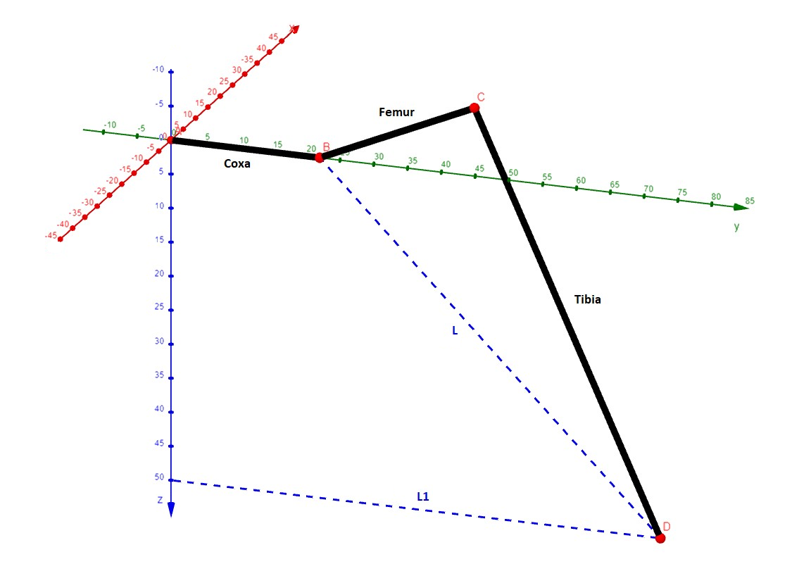
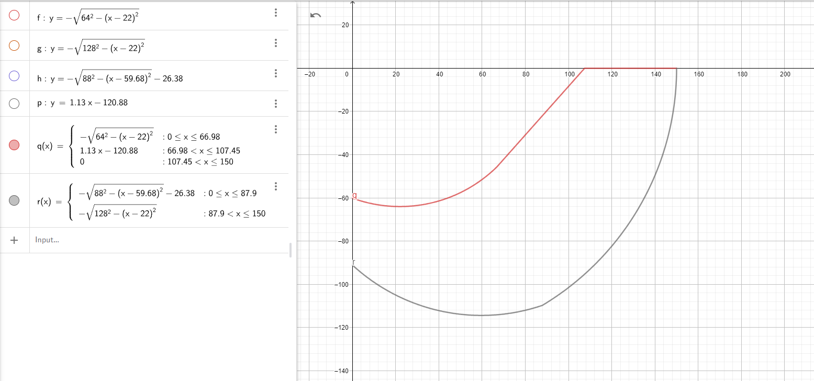

# Hexapod v4


## Background

Hexapods fascinating robots. They possess the ability to walk in any direction with their six legs, each leg (in this case) with three joints resulting in a total of 18 degrees of freedom. In addition, their body can turn and rotate in any direction, making this type of legged robot extremely flexible. But six legs also allow for fast, statically determined walking gates, i.e. lifting three legs each step. This removes the challenge of balancing during one step. 

As written in the title, this project is my fourth hexapod robot. It uses largely the same hardware as the previous generation but the code was rewritten entirely. The ReadMe was written in order to provide support and document the whole project. Feel free to contact me for questions/suggestions/improvements.

## Guidelines

In addition to the code in this repository, you will need two additional libraries, "Adafruit_PWMServoDriver.h" and "Arduino_BMI270_BMM150.h" for the servo driver and the IMU respectively. Just clone this repository and adjust the code to suit your robot. Almost all important constants are specified in Config.h, but a few other things also need to be changed, e.g. the constraints for leg movement (more on that later) or the servo pulse lengths. This ReadMe is written in a way which should allow you to follow my thought process during the creation of this robot. It is quite extensive so don't be afraid to skip some parts. The code is mathematically challenging, so you should be familiar with the basics of inverse kinematics and coordinate transformation in order to understand everything.

## Hardware

The robot is comprised of a 3D-printed body and six legs (CAD parts to be added). The four corner legs are turned by an angle of 30° relative to the middle legs, thus requiring more complex code. Consider mounting the corner legs parallel to the middle legs in your project to avoid the need for more coordinate transformation in your code. 
Each leg consists of three joints and three links refered to as coxa, femur and tibia. Each joint is directly screwed to the servo on one side and on the other a tiny bearing is used to reduce friction, add strength and avoid wear and tear.
The coxa link incorporates a limit switch to detect whether the leg is touching the ground. If the leg is touching the ground, the weight doesn't rest on the switch but the surrounding structure.

As for the electronics, the robot is powered by 18 TowerPro MG92b servo motors. As the name suggests, these servos use metal gears as well as a small bearing on the shaft, making them pretty robust and ideal for the use in this application. Nine servos are each connected to an [Adafruit PCA9685 16-Channel Servo Driver](https://learn.adafruit.com/16-channel-pwm-servo-driver/downloads), resulting in one servo driver for each side (left/right) of the robot. Make sure to use the original Adafruit servo driver since the cheaper alternatives often use a low-quality MOSFET which is not suitable for providing enough current for 18 servo motors. They are often marketed as LED-drivers only.
A 10V 1000uF capacitor is used as suggested by Adafruit to avoid voltage dips when all servos move at the same time, minimizing the chance for brownouts. The two servo drivers are connected to an Arduino Nano 33 BLE Sense Rev2 via I2C. Make sure that you power the servo motors not through the Arduino but directly from the power source (using the V+ pin on the board). In this robot, I used a rechargeable 6V 3000mAh NiMH-Battery which provides plenty of power while lasting a good 20-30 minutes. A large switch on the back of the robot acts as the killswitch, immediatly cutting power from the Arduino as well as the drivers.
The six limit switches are also connected to the Arduino using six of the GPIOs. Additionally, an ESP32 (potentionally with an integrated camera module) can be placed on top of the robot to stream a video feed of what the robot sees directly on your phone.

## Software
The code for this robot was entirely written in C++ (or rather the Arduino version of C++). The rough structure is as follows:
* A Leg class which handles the inverse kinematics of each leg (only the movement in the local coordinate system of each leg). This class also checks whether or not a (x, y, z) point is reachable for the end point of the leg and if the leg is touching the ground.
* A Hexapod class which is an aggregation of six leg instances. This class covers all movement patterns (such as crab walk, translation and rotation on the spot, turning, ...).
* The main Arduino programm, which is comprised of the setup() and the loop()-part. The setup()-part is run once and covers all the initialization of the servo drivers as well as setting pin modes, starting the IMU and so on. The loop() function is coded so that it is executed every 20ms, giving the hexapod an update rate of 50Hz. This means that the leg positions are calculated and the legs are moved to their positions every 20ms or 50 times a second. Running a fixed update rate allows for more flexible movement as a step is not necessarily excecuted as a whole and other movements can be superimposed.

(UML diagram to be added)

Let's take a look at the math-heavy challenges for this project

### Inverse kinematics of one leg
**Goal:** given a point (x, y, z) in the local coordinate frame of the leg, calculate the joint angles of the three servo motors so that the end point of the leg reaches the desired point
First, we assume that the point is valid/reachable (more on that later). Next we will have to take a look at the coordinate system and how the leg is positioned in it.

A, B and C are the coxa, femur and tibia joints while D is the desired point given in (x, y, z) coordinates. It becomes apparent that the coxa angle is only dependent on the x and y and can be calculated by using the atan2(y, x) function. Note that this returns radians, so you might need to convert to degrees. Perhaps you also need to mirror the value using map(), depending on the servo orientation.
The values for the femur and tibia joint are a bit more complex. First, we need to calculate two distances: L1 and L. L1 is simply the distance from the z-axis to point D, which can be found using the pythagorean theorem. L1 can than be used to calculate L, which is the distance from B to D. Again, it is found by using the pythagorean theorem. Now, by applying the law of cosine, the angles of the triangle BCD can be found. Make sure to shift/mirror the values to match the orientation of the servos. The code for calculating all three angles is as follows:

```
int coxaAngle = atan2(yValue, xValue) * 180 / PI;
coxaAngle = map(coxaAngle, 0, 180, 180, 0);
int femurAngle = (acos(zValue / L) + acos((tibiaLength * tibiaLength - femurLength * femurLength - L * L) / (-2 * femurLength * L))) * 180 / PI;
int tibiaAngle = (acos((L * L - tibiaLength * tibiaLength - femurLength * femurLength) / (-2 * tibiaLength * femurLength))) * 180 / PI;
```

The last thing to do is to actually move the servos. This can be achieved by calling the following line:

```
servoDriver.setPWM(pinCoxa, 0, angle(coxaAngle + offsetCoxa));
```
angle() is a function to convert the angle in degrees to the corresponding pulse width of the PWM signal (also described in the Adafruit Servo Driver documentation). The values in angle() have to be adjusted if another type of servo is used. offsetCoxa is the offset (in degrees) by which the (real) position of the leg differs compared to the ideal position. Find these values by assembling the robot, setting all servos to for example 90° and adjust the offsets until all joints are perfectly perpendicular.

### Calculating valid points
The leg can't reach every (x, y, z) point in 3D space. If we instruct the leg to move to an unreachable point, weird things can happen, potentionally even breaking the robot. Even if all points passed to the leg function _should_ be reachable, it is recommended to implement the following as a last safeguard:
The constrains for the coxaAngle parameter can be chosen by simply measuring how far the legs can rotate before hitting the neighboring leg rotating in the opposite direction. In this case, coxaAngle can only be in the interval [40°, 130°]
Instead of implementing constrains directly for tibiaAngle and femurAngle, we simply look at the L1 value and the z value and define an area in which L1 and z have to be to be valid. This area can be found mathematically or approximated using a CAD model (as shown in the image). By comparing L1 and z to the upper and lower bound, each point can be verified.



### The Hexapod class
As mentioned above, the six leg classes are passed to one Hexapod class which coordinates the legs and calculates all necessary points in the (local) coordinate system for each leg. The Hexapod class contains multiple methods for moving the robot:
* **Leg movement:** This elementary method moves all six legs to their positions as specified in the array, if they are reachable.
* **Rotation and translation on the spot:** This method has six parameters (and two pointers to the leg position arrays). Namely three (x-, y-, z-) translation values and three (roll, pitch, yaw) rotation values. The robot center is moved to match the given parameters, while all legs remain at their current position in the global coordinate frame. For example, a translation of xTrans = 30 means that the center of mass of the robot is shifted by 30mm to the front compared to home position, while an angle of roll = 0.2 (in radians) tilts the robot by approx. 11.5° sideways.
* **Crab walking:** Still under developement, a basic version is working but I have plans to improve it. 
* **Future walking gate:** A basic version of this gate also exists. The robot will take a step forwards or backwards while tracing the perimeter of a circle with the specified radius.
* **Offroad mode:** Uses the limit switches to move all legs until they touch the ground, allowing the robot to cross uneven terrain. All but the z positions of the legs is the same as in the crab walk gate.

### Calculating points for each leg
Since we have one coordinate frame in the center of mass of the robot and six local coordinate frames, one in the coxa joint of each leg, we need to convert between the frames. This can be done in multiple ways, for example using rotation matrices and shifting of the planes. 

To calculate the new end point of a leg in the local coordinate frame resulting from a translation along one of the axis of the coordinate frame in the center of mass, we first need to shift and rotate the local frame to match the frame in the center of mass. In the example, this is done in the first 11 lines of code. In lines 5-7 the coordinate frame (more exact only the current end point) is rotated by 30° since the corner legs are mounted at an angle. 
In lines 10-11 the frame is shifted so that both origins coincide.

Now, the desired translation and rotation can be applied. First, in lines 14-16, the end point is shifted by the desired amount to achieve the translation. Second, the point is rotated by multiplying it with rotMatrix[][], which is a complete 3x3 roll pitch yaw rotation matrix.
At last, the local coordinate frame has to be transformed back. This time, it is first shifted back and then rotated back by 30°.

```
// ++++++++++++++++++++++++++++++
// leg front right
// ++++++++++++++++++++++++++++++
// rotate the local coordinate system by 30°
int temp = newPositions[0][0];
newPositions[0][0] = newPositions[0][0] * cos(-cornerLegAngle) - newPositions[0][1] * sin(-cornerLegAngle);
newPositions[0][1] = temp * sin(-cornerLegAngle) + newPositions[0][1] * cos(-cornerLegAngle);

//shift the local coordinate system to the center of mass
newPositions[0][0] += cornerLegXDistGlobal;
newPositions[0][1] += cornerLegYDistGlobal;

// translation of leg end point
newPositions[0][0] -= xTrans;
newPositions[0][1] -= yTrans;
newPositions[0][2] += zTrans;

// rotating the end point using RotMatrix
for (int i = 0; i < 3; ++i) {
  result[i] = 0.0;
}

for (int i = 0; i < 3; ++i) {
  for (int j = 0; j < 3; ++j) {
    result[i] += (rotMatrix[i][j] * newPositions[0][j]);
  }
}
for (int i = 0; i < 3; ++i) {
  newPositions[0][i] = result[i];
}

//shift the local coordinate system back
newPositions[0][0] -= cornerLegXDistGlobal;
newPositions[0][1] -= cornerLegYDistGlobal;

//rotate the coordinate system back by -30°
temp = newPositions[0][0];
newPositions[0][0] = newPositions[0][0] * cos(cornerLegAngle) - newPositions[0][1] * sin(cornerLegAngle);
newPositions[0][1] = temp * sin(cornerLegAngle) + newPositions[0][1] * cos(cornerLegAngle);
```

All other legs follow the same principle, only the sign of some values and the amount by which the frames need to be shifted and rotated change.

Improvements/additions would be to use quaternions for faster computation of the rotations or to just use 4x4 homogeneous matrices to first transform the coordinate frames and then calculate the translation and rotation in one step (and then transforming the frame back of course).

### Main loop
As already mentioned, the loop() function is called every 20ms. At the beginning of each loop() excecution, a method of the Hexapod class (e.g. Hexapod.calcCrabwalk()) can be called which modifies an array containing (x, y, z) positions for all six legs, writing the new values. Additionally, the Hexapod.calcBodyMovement() method is called **every** loop iteration which allows for flexible superimposition of body rotation and translation ontop of the movement of the robot.
A counter keeps track of the number of loop() calls. This counter can be used to program sequences, e.g. three steps to the left, then rotating on the spot, four steps forward, ...
