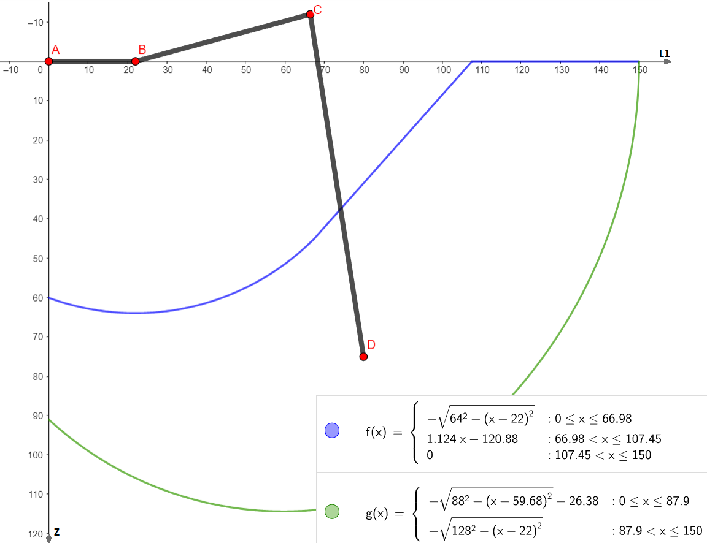

# Hexapod v4


## Background

Hexapods are six legged robots. They possess the ability to walk in any direction, each leg (in this case) with three joints resulting in a total of 18 degrees of freedom. In addition, their body can turn and rotate in any direction, making this type of legged robot extremely flexible. But six legs also allow for fast, statically determined walking gates, i.e. lifting three legs each step while the three other legs stay on the ground. This removes the challenge of balancing during one step. 

As written in the title, this project is my fourth hexapod robot. It uses largely the same hardware as the previous generation but the code was rewritten entirely. The ReadMe was written in order to provide support and document the whole project. Feel free to contact me for questions/suggestions/improvements.

## Guidelines

In addition to the code in this repository, you will need two additional libraries, "Adafruit_PWMServoDriver.h" and "Arduino_BMI270_BMM150.h" for the servo driver and the IMU respectively. Just clone this repository and adjust the code to suit your robot. Almost all important constants are specified in Config.h, but a few other things also need to be changed, e.g. the constraints for leg movement (more on that later) or the servo pulse lengths. This ReadMe is written in a way which should allow you to follow my thought process during the creation of this robot. It is quite extensive so don't be afraid to skip some parts. The code is mathematically challenging, so you should be familiar with the basics of inverse kinematics and coordinate transformation in order to understand everything.

## Hardware

The robot is comprised of a 3D-printed body and six legs (CAD parts to be added). The four corner legs are turned by an angle of 30° relative to the middle legs, thus requiring more complex code. Consider mounting the corner legs parallel to the middle legs in your project to avoid the need for more coordinate transformation in your code. 
Each leg consists of three joints and three links refered to as coxa, femur and tibia. Each joint is directly screwed to the servo on one side and on the other a tiny bearing is used to reduce friction, add strength and avoid wear and tear.
The coxa link incorporates a limit switch to detect whether the leg is touching the ground. If the leg is touching the ground, the weight doesn't rest on the switch but the surrounding structure.

As for the electronics, the robot is powered by 18 TowerPro MG92b servo motors. As the name suggests, these servos use metal gears as well as a small bearing on the shaft, making them pretty robust and ideal for the use in this application. Nine servos are each connected to an [Adafruit PCA9685 16-Channel Servo Driver](https://learn.adafruit.com/16-channel-pwm-servo-driver/downloads), resulting in one servo driver for each side (left/right) of the robot. Make sure to use the original Adafruit servo driver since the cheaper alternatives often use a low-quality MOSFET which is not suitable for providing enough current for 18 servo motors. They are often marketed as LED-drivers only.
A 10V 1000uF capacitor is used as suggested by Adafruit to avoid voltage dips when all servos move at the same time, minimizing the chance for brownouts. The two servo drivers are connected to an Arduino Nano 33 BLE Sense Rev2 via I2C. Make sure that you power the servo motors not through the Arduino but directly from the power source (using the V+ pin on the board). In this robot, I used a rechargeable 6V 3000mAh NiMH-Battery which provides plenty of power while lasting a good 20-30 minutes. A large switch on the back of the robot acts as the killswitch, immediatly cutting power from the Arduino as well as the drivers.
The six limit switches are also connected to the Arduino using six of the GPIOs. Additionally, an ESP32 (potentionally with an integrated camera module) can be placed on top of the robot to stream a video feed of what the robot sees directly on your phone.

## Software
The code for this robot was entirely written in C++ (or rather the Arduino version of C++). The rough structure is as follows:
* A Leg class which handles the inverse kinematics of each leg (only the movement in the local coordinate system of each leg). This class also checks whether or not a (x, y, z) point is reachable for the end point of the leg and if the leg is touching the ground.
* A Hexapod class which is an aggregation of six leg instances. This class covers all movement patterns (such as crab walk, translation and rotation on the spot, turning, ...).
* The main Arduino programm, which is comprised of the setup() and the loop()-part. The setup()-part is run once and covers all the initialization of the servo drivers as well as setting pin modes, starting the IMU and so on. The loop() function is coded so that it is executed every 10ms, giving the hexapod an update rate of 100Hz. This means that the leg positions are calculated and the legs are moved to their positions every 10ms or 100 times a second. Running a fixed update rate allows for more flexible movement as a step is not necessarily excecuted as a whole and other movements can be superimposed.

(UML diagram to be added)

Let's take a look at the math-heavy challenges for this project

### Inverse kinematics of one leg
**Goal:** given a point (x, y, z) in the local coordinate frame of the leg, calculate the joint angles of the three servo motors so that the end point of the leg reaches the desired point
First, we assume that the point is valid/reachable (more on that later). Next we will have to take a look at the coordinate system and how the leg is positioned in it.


A, B and C are the coxa, femur and tibia joints while D is the desired point given in (x, y, z) coordinates. It becomes apparent that the coxa angle is only dependent on the x and y and can be calculated by using the atan2(y, x) function. Note that this returns radians, so you might need to convert to degrees. Perhaps you also need to mirror the value using map(), depending on the servo orientation.
The values for the femur and tibia joint are a bit more complex. First, we need to calculate two distances: L1 and L. L1 is simply the distance from the z-axis to point D, which can be found using the pythagorean theorem. L1 can than be used to calculate L, which is the distance from B to D. Again, it is found by using the pythagorean theorem. Now, by applying the law of cosine, the angles of the triangle BCD can be found. Make sure to shift/mirror the values to match the orientation of the servos. The code for calculating all three angles is as follows:

```
int coxaAngle = atan2(yValue, xValue) * 180 / PI;
coxaAngle = map(coxaAngle, 0, 180, 180, 0);
int femurAngle = (acos(zValue / L) + acos((tibiaLength * tibiaLength - femurLength * femurLength - L * L) / (-2 * femurLength * L))) * 180 / PI;
int tibiaAngle = (acos((L * L - tibiaLength * tibiaLength - femurLength * femurLength) / (-2 * tibiaLength * femurLength))) * 180 / PI;
```

The last thing to do is to actually move the servos. This can be achieved by calling the following line:

```
servoDriver.setPWM(pinCoxa, 0, angle(coxaAngle + offsetCoxa));
```
angle() is a function to convert the angle in degrees to the corresponding pulse width of the PWM signal (also described in the Adafruit Servo Driver documentation). The values in angle() have to be adjusted if another type of servo is used. offsetCoxa is the offset (in degrees) by which the (real) position of the leg differs compared to the ideal position. Find these values by assembling the robot, setting all servos to for example 90° and adjust the offsets until all joints are perfectly perpendicular.

### Calculating valid points
The leg can't reach every (x, y, z) point in 3D space. If we instruct the leg to move to an unreachable point, weird things can happen, potentionally even breaking the robot. Even if all points passed to the leg function _should_ be reachable, it is recommended to implement the following as a last safeguard:
The constrains for the coxaAngle parameter can be chosen by simply measuring how far the legs can rotate before hitting the neighboring leg rotating in the opposite direction. In this case, coxaAngle can only be in the interval [40°, 130°]
Instead of implementing constrains directly for tibiaAngle and femurAngle, we simply look at the L1 value and the z value and define an area in which L1 and z have to be to be valid. This area can be found mathematically or approximated using a CAD model (as shown in the image). By comparing L1 and z to the upper and lower bound, each point can be verified.



### The Hexapod class
As mentioned above, the six leg classes are passed to one Hexapod class which coordinates the legs and calculates all necessary points in the (local) coordinate system for each leg. The Hexapod class contains multiple methods for moving the robot:
* **moveLegs():** This elementary method moves all six legs to their positions as specified in the array, if they are reachable.
* **calcBodyMovement():** This method has six parameters (and two pointers to the leg position arrays). Namely three (x-, y-, z-) translation values and three (roll, pitch, yaw) rotation values. The robot center is moved to match the given parameters, while all legs remain at their current position in the global coordinate frame. For example, a translation of xTrans = 30 means that the center of mass of the robot is shifted by 30mm to the front compared to home position, while an angle of roll = 0.2 (in radians) tilts the robot by approx. 11.5° sideways. Note that this method doesn't actually move the legs but rather calculates the positions of all legs and writes them in the <code>newPositions[][]</code> array. The moveLegs() method has to be called to actually move the legs.
* **calcStep():** Universal method which lets the robot walk. It should be called periodically as many times as specified in stepNumber. In the first iteration, the final coordinates for each leg at the end of the step are calculated. In the following iterations, the current position is interpolated between the starting position and the final position. 
* **Offroad mode:** Still needs to be implemented. Using the end switches, the robot will detect whether its legs touch the surface and adjust the z coordinate accordingly.

### Calculating points for each leg
Since we have one coordinate frame in the center of mass of the robot and six local coordinate frames, one in the coxa joint of each leg, we need to convert between the frames. This can be done in multiple ways, for example using rotation matrices and shifting of the planes. 

To calculate the new end point of a leg in the local coordinate frame resulting from a translation along one of the axis of the coordinate frame in the center of mass, we first need to shift and rotate the local frame to match the frame in the center of mass. To keep the code simple, an array is used to store the relative distances and angles between the local coordinate systems of each leg and the global coordinate system this array (<code>legCoords[][]</code>) is specified in [Config.h](Config.h).

Now, the desired translation and rotation can be applied. First, the end point is shifted by the desired amount to achieve the translation. Second, the point is rotated by multiplying it with rotMatrix[][], which is a complete 3x3 roll pitch yaw rotation matrix.
At last, the local coordinate frame has to be transformed back, first shifting it and then rotating it.

```
for (uint8_t k = 0; k < 6; ++k) {  // iterate over all legs

    // check if the leg should move (0b100000 is FR, 0b010000 is FL, ... 0b000001 is RL)
    if (legMask & (1 << (5 - k))) {

      // rotate the local coordinate system by the angle specified in legCoords[][]
      int temp = newPositions[k][0];
      newPositions[k][0] = newPositions[k][0] * cos(-legCoords[k][2]) - newPositions[k][1] * sin(-legCoords[k][2]);
      newPositions[k][1] = temp * sin(-legCoords[k][2]) + newPositions[k][1] * cos(-legCoords[k][2]);

      //shift the local coordinate system to the center of mass
      newPositions[k][0] += legCoords[k][0];
      newPositions[k][1] += legCoords[k][1];

      // translation of leg end point
      newPositions[k][0] -= xTrans;
      newPositions[k][1] -= yTrans;
      newPositions[k][2] += zTrans;

      // rotating the end point using RotMatrix
      float result[3] = { 0.0, 0.0, 0.0 };

      for (int i = 0; i < 3; ++i) {
        for (int j = 0; j < 3; ++j) {
          result[i] += (rotMatrix[i][j] * newPositions[k][j]);
        }
      }
      for (int i = 0; i < 3; ++i) {
        newPositions[k][i] = result[i];
      }

      //shift the local coordinate system back
      newPositions[k][0] -= legCoords[k][0];
      newPositions[k][1] -= legCoords[k][1];

      //rotate the coordinate system back by the mounting angle of the leg
      temp = newPositions[k][0];
      newPositions[k][0] = newPositions[k][0] * cos(legCoords[k][2]) - newPositions[k][1] * sin(legCoords[k][2]);
      newPositions[k][1] = temp * sin(legCoords[k][2]) + newPositions[k][1] * cos(legCoords[k][2]);
    }
  }
```

The code above iterates over all legs. The bitmask allows only specific legs to move. As standard, all legs are moved (<code>legMask = 0b111111</code>). The first bit (MSB) corresponds to the front right leg, the last bot (LSB) to the rear left leg.

Improvements/additions would be to use quaternions for faster computation of the rotations or to just use 4x4 homogeneous matrices to first transform the coordinate frames and then calculate the translation and rotation in one step (and then transforming the frame back of course).

### Walking in any direction
Two approaches exist to create a walking motion in any direction (aka crab walk). Both approaches lift three legs, while the other three legs move the body. For example, the front left, middle right and rear left legs are being lifted, while the front right, middle left and rear right legs push the hexapod in the desired direction. The first version is simpler, but doesn't allow for long step distances, thus resulting in a more "unnatural" motion:

A "home position" is defined (in the local coordinate frame, as an (x, y, z) point), to which the three legs which were lifted return after every step. As a result, three legs are guaranteed to be at the home position in the beginning of each step. From there, new points are calculated for each of the three legs. These new points describe the final position of the legs at the end of the step. The other legs (which were previously **not** at home position) just return to home position.
Final positions for the three legs can be calculated by simply transforming (rotating) the vector by which the hexapod moves in the local coordinate system and then subtracting the vector from the home position. This vector can be passed to the method as two parameters, namely stepDist and stepDirection. stepDist is the length of the vector by which the hexapod moves while stepDirection is the angle, in which the step is taken (simply a 2D-vector in polar coordinates). For example, <code>stepDist = 20</code> and <code>stepDirection = PI</code> will result in a step with a length of 20mm backwards (PI (rad) = 180°).
While providing a simple form of movement, which is also quite flexible (all possible steps can be executed after a step, the step length and direction is known, ...), it looks pretty unnatural. In addition, the maximum step length is short with only around 40mm. To achieve longer steps with more natural movement, another approach can be taken:

In this approach, a "home position" is defined also. The leg isn't actually moved to the home position, but the position is used to construct a circle, in which the leg operates at every point in time. The size of the circle will later determine the maximum step length. The difference in comparison to the previous approach is the position at which the legs are after every step (obviously, duh...). After one step **all six** legs will be on the circumference of the circle. The three legs moving the hexapod will move from their current position in the given direction, until they hit the boundary of the circle. The three legs which were returning to home position in the previous approach will now be lifted and moved in the opposite direction until they hit the boundary of the circle, thus allowing the *next* step to be of maximum length. One can simply notice, that the maximum length can only be achieved if the next step is taken in the same direction as the previous (or the exact opposite direction) and, in the worst case, no movement is possible at all. This worst case occurs if the next step's direction is exactly 90° from the previous step. By keeping track of the previous step direction, the pair of legs which can perform the longest step in the new direction can be determined. Therefore, the difference between the previous and the new direction is considered. If the difference is smaller than 90°, the other set of legs is moved (e.g. if in the previous step, legs front right, mid left and rear right moved the robot and the new direction is 45° larger than in the previous step, the other set of legs will now move the robot). If the difference is larger than 90°, the same set of legs which performed the previous step will also perform the next step, as they can move the longest distance.

Up until now, the robot can walk in all directions, but can't rotate in any form. To fix this, a trick can be used: After all final positions for the current step are calculated, these final positions can be rotated. Using the calcBodyMovement() method along with a mask, a rotation (yaw) is applied to the three legs which move the robot. While this allows the robot to move in any direction with any rotation superimposed, it also means that the final positions are not guaranteed to be inside of the circle anymore. Therefore, other precautions must be taken to avoid unwanted behaviour.

```
if ((overlayRotation > 0.02 && overlayRotation < 0.3) || (overlayRotation < -0.02 && overlayRotation > -0.3)) {  // avoid too crazy turn angles and unnecessary calculation
  uint8_t mask = 0b100110;                                                                                       // apply rotation only to the stationary legs FR, ML, RR
  if (moveRightLeg == false) {
    mask = 0b011001;  // change if the other set of legs (FL, MR, RL) if they are stationary
  }
  calcBodyMovement(finalPositions, finalPositions, 0, 0, 0, 0.0, 0.0, overlayRotation, mask);
}
```

(Image to be added)

### Main loop
As already mentioned, the <code>loop()</code> function is called every 10ms. During each loop iteration, the legs are moved once using <code>myHexapod.moveLegs(newPositions)</code>. <code>newPositions[][]</code> can be can be calculated using either <code>myHexapod.calcStep()</code>, <code>myHexapod.calcBodyMovement()</code> or both. Example usage is provided in <code>exampleSteps()</code> and <code>exampleBodyMovement()</code>. The <code>myHexapod.getAction()</code> method can be used to check whether the robot is executing a step or resting at the moment. Additionally, a loopCounter is used to keep track of the number of times the loop has been executed. The green LED of the Arduino BLE is also toggled in every loop.
